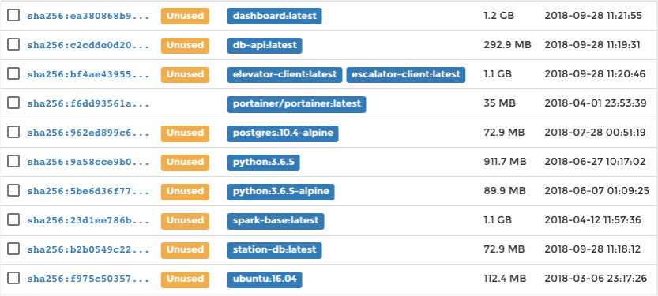
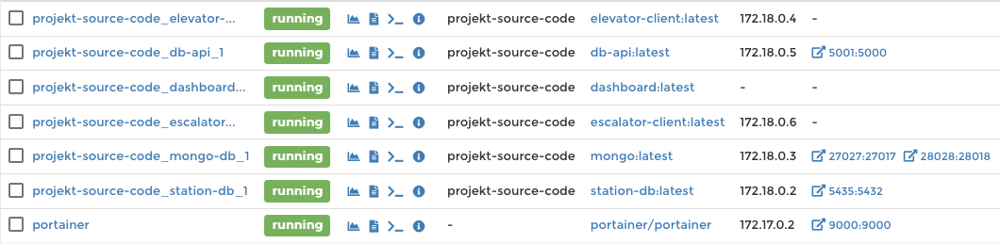

# EVA-Projekt

### Summery
This is the repository for the EVA project

The aim of this project is to develop a distributed application using the FaSTa API of Deutsche Bahn AG. 
The web application should provide information about the current operating status of each elevator and escalator at a train station of Deutsche Bahn. 
Users can thus quickly and easily convince themselves of the functionality of an elevator or escalator at their stop. 
In addition, statistics on the elevator systems and their downtimes are to be collected. 
These could be of great relevance both for interested users and for DB itself.

#### Project structure


### Requirements

Python 3.5+

### Support

While we can not provide individual support at the moment, you can see this repository as a public hub to collect feedbacks, bug reports and feature requests.

Please refer to the issue page and feel free to open a ticket.

### Installation & Usage

Pull the repo from github.

```
git clone https://github.com/JoshPrim/EVA-Projekt

cd EVA-Projekt
```

A directory structure with two main folders was selected for the target server. 
On the one hand the project source code with the docker-compose.yml is in line three. 
This is the source folder to call all Docker commands in the console. 
Secondly, there is a directory for the volume mapping between containers and host. 
This includes the path to the mongo folder. 
At runtime of the Mongo database, all data is written to this folder and stored for the long term, even if the application is shut down again. 
The dump folder is primarily used for importing and exporting data from the Mongo database. 
When the Mongo is initialized for the first time, it is then necessary to import the data already collected from this folder. 
Finally, it should be noted that this project structure is not absolutely necessary, but can be designed individually. 
If this path is chosen, it is necessary to adjust the paths for the volume mapping in docker-compose.yml afterwards.

```
eva-dev
│   └── project-source-code
└── mnt
    ├── logs
    │   ├── elevator
    │   └── escalator
    └── mongo
        └── configdb
        └── data
            └── dump
```

Docker can be operated entirely from a system terminal. 
However, there are also freely usable interfaces that can clearly display all resources in Docker.

Portainer can be quickly and easily downloaded and started as a container via DockerHub. 

Please note that there has to be a mapping between the docker.sock on the host and the Portainer container. 

Otherwise Portainer cannot access the Docker Daemon. Then the access takes place via the localhost:9000. 

At the first start Portainer is required to set an admin password for the login. 

Portainer stores this information in the container under the path /data portainer/portainer. 

The following code section executes Portainer within a container on the target server. 


```
$ docker run -d \
-p 9000:9000 \
-v /var/run/docker.sock:/var/run/docker.sock \
-v <portainer_data>:/data portainer/portainer

```

After all necessary project files have been deployed to the target computer, the next step is to navigate to the root project folder. 
The Docker images must then be generated with the following command:

```
~/projekt-source-code$ docker-compose build
```

After successful image generation, Portainer should display a list of the created images in the Images tab, as shown in the following Figure.



The complete application is then executed with the following command. 

```
~/projekt-source-code$ docker-compose up -d
```

The flag -d means that the containers continue to run in the background after the Docker-Compose command. 
Then the running containers should be in Portainer under the Container tab as shown in the following Figure.



For a quick check of the services, the application routes or the dashboard can be accessed via the browser at this point. 

```
/localhost:5001/facility/all -> all movement data of the facilities
/localhost:5001/facility/count -> number of transaction data in mongo
/localhost:5001/station/all -> all master data of the stations
/localhost:37002/ -> dashboard
```

For a host-wide deployment of the application, Docker must first be started in Swarm mode. 
First, a swarm has to be initialized on the host: 

```
docker swarm init
```

The application is then deployed as a stack as follows:
```
docker stack deploy -c docker-compose.yml eva_dev
```

Each service is initially started without replication. 
In the Services tab, you can see this in Portainer and change the number of service containers belonging to it. 
Replication and load balancing can best be illustrated with the db-api service. 
After a replication has been set for this service, this service can be accessed via localhost:5001/facility/count. 
As soon as the web page with the number of documents in the Mongo database is displayed, the website can be called again. 
After each call, the ID of the hostname is rotated according to the round-robin principle. 
The stack can then be shut down again with the following command.

```
docker stack rm eva_dev
```

### Licence 

Apache-2.0 


